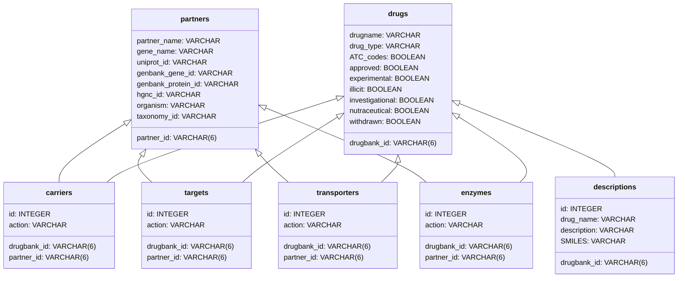

# drugbank-importer

`drugbank-importer` is a command-line tool meant to convert
[DrugBank](https://go.drugbank.com/)'s
[XML](https://go.drugbank.com/releases/latest) into several formats (currently
`csv` and any database supported by sqlalchemy 2.x).

It is implemented in python and freely inspired from [zzploveyou's
fork](https://github.com/zzploveyou/drugbank_xml2csv_python) or [tal-baum
implementation](https://github.com/tal-baum/drugbank_xml2csv_python/).

## Usage

```text
$ drugbank-import --help
Usage: drugbank-import [OPTIONS]

Options:
  -f, --file-path PATH  Path to the DrugBank XML dump
  -t, --target TEXT     Where to save the import, either a path to a directory
                        (for CSV) or a sqlalchemy ressource locator, e.g.
                        `sqlite://` for memory or `sqlite:///tmp/database.db`
                        for `/tmp/database.db`
  -l, --limit INTEGER   Limit the number of records to proceed
  --help                Show this message and exit.
```

For instance, the following command would import data from the first 10 drug
records contained in `drugbank.xml`, and save them in a sqlite file `test.db`:

```sh
drugbank-import -f drugbank.xml -l 10 -t sqlite:///test.db
```

The database schema is the following:



## Motivation

Both the [original
implementation](https://github.com/tal-baum/drugbank_xml2csv_python/) and [its
fork](https://github.com/zzploveyou/drugbank_xml2csv_python) share the same
design:

- the XML file is parsed into a tree
- the tree is traversed, while information about drugs and their targets is
  extracted and accumulated
- accumulated information is serialized into `csv` files

This design and subsequent control flow is simple to read and understand, which
is of paramount importance for this kind of data importers. However, it comes
with a few issues:

- the DrugBank XML file is ~1.5 GB (as of 2022-12), and all associated
  data structures may hardly fit in memory
- all the information extracted about drugs and targets have to fit in memory as
  well
- the extraction of drug/target information and their serialization is highly
  coupled: extracting new fields or creating new "tables" can quickly become not
  trivial
- only `csv` support is provided (although it can be later imported easily in a
  database, at the cost of an extra step).

`drugbank-importer` has been designed to solve these issues.

## How it works

Being less script-ish, `drugbank-importer` is a bit harder to read and
understand at first sight and worth a short explanation about how it leverages
several powerful techniques to solve the aforementioned limits:

- iterative parsing: DrugBank records are parsed into an XML tree one by one
- lazy evaluation: generators are used both to yield DrugBank records, and to
  issue records for drugs, targets, etc.
- the extraction and serialized steps are separated, to support multiple
  backends (currently `csv` and any database supported by sqlalchemy 2.x)

Instead the procedural steps mentioned above, `drugbank-importer` does the
following:

- a generator issues a subset of lines corresponding to a drug record in XML
  format
- this generator is consumed by another generator which creates the XML tree for
  this particular subset of lines, parses the information that need to be
  serialized, and yield it as `Dict`
- this last generator is consumed by a serialization function that can be chosen
  at runtime (either to file or to arbitrary sqlalchemy locations)

The most notable difference with the former approach is that control is deferred
to the serializers, which receive business entities to serialize as they are
produced.
